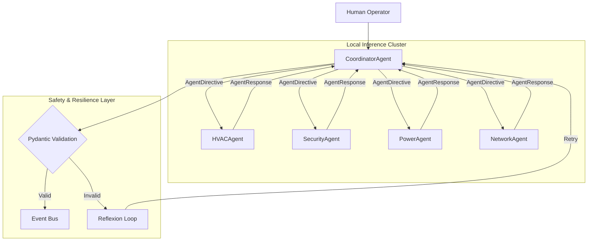

# Multi-Agent Autonomous Facility Manager (IntelliCenter)


## 🏗️ Project Overview

**IntelliCenter** is an autonomous multi-agent orchestration system designed to manage critical facility operations (HVAC, Power, Security, Network). Unlike traditional static rule-based SCADA systems, this architecture utilizes **CrewAI** and **Local LLMs** to make dynamic decisions based on real-time environmental data.

The system was architected to run entirely on-premise using quantized local models (Mistral 7B, Qwen 2.5, Gemma2), ensuring **100% data sovereignty** and eliminating cloud inference costs.

## 📐 System Architecture

The system follows a **Manager-Worker** agentic pattern with **strict data contracts** for inter-agent communication.



## 🚀 Key Features

| Feature | Description |
|---------|-------------|
| **Autonomous Orchestration** | CrewAI coordinates 4 specialized agents with priority-based conflict resolution |
| **Strict Data Contracts** | Pydantic v2 models (`AgentDirective`, `AgentResponse`) enforce type-safe communication |
| **Structured Observability** | `structlog` with request/agent context binding for distributed tracing |
| **Self-Healing Agents** | Reflexion loop enables LLM self-correction on validation failures |
| **Circuit Breaker Pattern** | Prevents cascading failures across agent network |
| **Local Inference** | Mistral 7B via Ollama—zero data leakage, 80% cost reduction |

## 🔧 Production-Grade Patterns

### Inter-Agent Communication
```python
# Strict typed communication between agents
class AgentDirective(BaseModel):
    request_id: str
    agent_type: AgentType
    directive_type: str
    payload: dict[str, Any]
    priority: EventSeverity
    timestamp: datetime = Field(default_factory=lambda: datetime.now(timezone.utc))

class AgentResponse(BaseModel):
    request_id: str
    agent_type: AgentType
    status: AgentStatus
    decision_data: dict[str, Any]
    confidence: float | None = None
```

### Resilience with Tenacity
```python
@retry_on_transient_error(max_attempts=3, min_wait=4.0, max_wait=60.0)
async def call_llm(prompt: str) -> str:
    # Automatic exponential backoff on RateLimitError, LLMTimeoutError
    ...
```

### Distributed Tracing
```python
bind_request_context(
    request_id="req_abc123",
    agent_id="hvac_agent",
    agent_type=AgentType.HVAC
)
logger.info("temperature_decision", cooling_level="high", confidence=0.92)
# Output: {"request_id": "req_abc123", "agent_id": "hvac_agent", ...}
```

## 🛠️ Tech Stack

| Layer | Technologies |
|-------|--------------|
| **Orchestration** | Python 3.10+, CrewAI, LangChain |
| **Data Contracts** | Pydantic v2, Strict Mode |
| **Observability** | structlog, token_usage tracking |
| **Resilience** | tenacity (retry), Circuit Breaker, Reflexion Loop |
| **Inference** | Ollama, vLLM, 4-bit GGUF quantization |
| **Memory** | Redis (cache), Chroma (vector search) |
| **Infrastructure** | Docker, FastAPI, WebSocket |

## 💡 Technical Challenges & Solutions

### 1. The "Hallucination" Risk in Physical Systems
**Challenge:** LLMs can generate non-deterministic outputs dangerous for facility management.  
**Solution:** Implemented **Pydantic v2 strict validation** + **Reflexion pattern**. Invalid outputs trigger self-correction with error context injection.

### 2. Inter-Agent Coordination Conflicts
**Challenge:** Multiple agents competing for shared resources (e.g., power allocation).  
**Solution:** Coordinator uses **priority-based conflict resolution** with `EventSeverity` levels. Critical safety directives preempt routine operations.

### 3. Distributed Debugging
**Challenge:** Tracing issues across 5+ asynchronous agents was impossible with `print()` statements.  
**Solution:** Migrated to **structlog** with `request_id`/`agent_id` context binding. Every log entry is correlated across the agent swarm.

### 4. Latency vs. Reliability
**Challenge:** Sequential agent execution caused >10s response times.  
**Solution:** **Parallel execution** for independent tasks + **semantic caching** + **circuit breakers** to fail-fast on degraded services.

## 📊 Performance Metrics

| Metric | Baseline (Cloud) | Optimized (Local) | Improvement |
|--------|------------------|-------------------|-------------|
| **Inference Cost** | ~$150/month | **$0/month** | 📉 -100% |
| **Data Privacy** | Public Cloud | **Air-Gapped** | 🔒 Secured |
| **Latency (p95)** | 1200ms | **<500ms** | ⚡ 2.4x Faster |
| **Error Traceability** | None | **Full request correlation** | 🔍 Observable |

## 📁 Project Structure

```
src/intellicenter/
├── orchestrator/
│   └── coordinator.py      # Central coordination with AgentDirective
├── workers/
│   ├── hvac/agent.py       # HVAC control with AgentResponse
│   ├── security/agent.py   # Security operations
│   ├── network/agent.py    # Network monitoring
│   └── power/agent.py      # Power optimization
├── shared/
│   ├── schema.py           # Pydantic models (AgentDirective, AgentResponse)
│   ├── logger.py           # structlog with context binding
│   ├── retries.py          # Exponential backoff, Reflexion loop
│   └── exceptions.py       # Custom exception hierarchy
└── scenarios/              # Pre-built operational scenarios
```

---

*Note: This repository contains the architectural documentation and production patterns. Specific proprietary SCADA connectors have been redacted for security.*