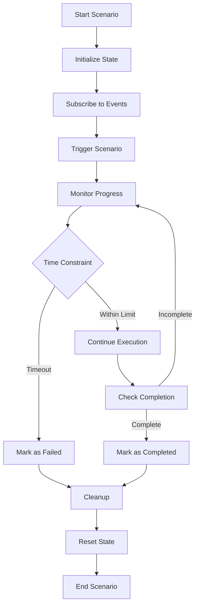

# IntelliCenter System Architecture

## Overview

IntelliCenter implements a distributed multi-agent architecture with specialized AI agents coordinating through a centralized event bus to optimize data center operations in real-time. The system is designed for scalability, performance, and reliability while operating within hardware constraints (RTX 4060 with 8GB VRAM).

**Architecture Principles:**
- **Decentralized Intelligence**: Each agent operates independently with specialized expertise
- **Event-Driven Coordination**: Async event bus enables real-time communication
- **Hierarchical Orchestration**: Coordinator agent provides strategic oversight
- **Memory-Optimized**: Designed for constrained GPU environments
- **Fault-Tolerant**: Comprehensive error handling and fallback mechanisms

---

## Final Architecture Highlights (Demo-Ready)

- Event-driven core via [intellicenter/core/event_bus.py](intellicenter/core/event_bus.py:1)
  - Asynchronous publish/subscribe with typed topics
  - Used by both live runs and fallback playback

- WebSocket server [intellicenter/api/websocket_server.py](intellicenter/api/websocket_server.py:1)
  - Port: 8000
  - Endpoints:
    - WS: /ws (broadcasts agent status, coordination directives, event logs)
    - HTTP: /health (readiness), /agents/status (current agent state)
  - CORS enabled for Vite dev server (http://localhost:5173)

- Multi-agent orchestration [intellicenter/scenarios/scenario_orchestrator.py](intellicenter/scenarios/scenario_orchestrator.py:1)
  - Built-in scenarios: cooling_crisis, security_breach, energy_optimization, routine_maintenance
  - Lifecycle: initialize → execute steps → evaluate success → cleanup → reset

- Memory management [intellicenter/core/memory_manager.py](intellicenter/core/memory_manager.py:1)
  - RTX 4060 constraints: max concurrent models 2, threshold 7GB, cleanup and LRU
  - Integrated with LLM manager [intellicenter/llm/llm_config.py](intellicenter/llm/llm_config.py:1)

- Fallback mode (deterministic playback)
  - Runner re-exported as Python package: [dev_tools/demo_fallback.py](dev_tools/demo_fallback.py:1)
  - Pre-recorded responses in [dev-tools/responses](../dev-tools/responses/cooling_crisis.json:1)
  - Used by [run_demo.py](../run_demo.py:1) with --mode fallback, or direct [dev-tools/demo_fallback.py](../dev-tools/demo_fallback.py:1)

- Frontend data path
  - WebSocket → [frontend/src/hooks/useWebSocket.ts](../frontend/src/hooks/useWebSocket.ts:1) → UI components (FacilityLayout, AgentStatus, PerformancePanel)

### Message Flow (text sequence)

```
run_demo.py (live) OR dev_tools.demo_fallback → EventBus
EventBus → WebSocketServer (subscribes and broadcasts)
WebSocketServer (/ws @ :8000) → Frontend (useWebSocket hook @ http://localhost:5173)
Frontend → Components (render status, logs, directives)
```
## System Architecture Diagram

```
┌─────────────────────────────────────────────────────────────────────────┐
│                           INTELLICENTER SYSTEM                          │
├─────────────────────────────────────────────────────────────────────────┤
│                                                                         │
│  ┌─────────────────┐  ┌─────────────────┐  ┌─────────────────────────┐   │
│  │   Frontend       │  │   WebSocket     │  │   Event Bus           │   │
│  │   Dashboard      │◄─►│   Server        │◄─►│   (Core System)       │   │
│  │   (React)       │  │   (FastAPI)     │  │   (Async Event Bus)   │   │
│  └─────────────────┘  └─────────────────┘  └─────────────────────────┘   │
│                                                   │                       │
│  ┌─────────────────────────────────────────────────────────────────────┐   │
│  │                         AGENT LAYER                                 │   │
│  │                                                                     │   │
│  │  ┌─────────────┐  ┌─────────────┐  ┌─────────────┐  ┌─────────────┐ │   │
│  │  │ HVAC Agent  │  │Power Agent  │  │Security     │  │Network      │ │   │
│  │  │(Thermal)    │  │(Energy)     │  │Agent        │  │Agent        │ │   │
│  │  └─────────────┘  └─────────────┘  └─────────────┘  └─────────────┘ │   │
│  │                                                                     │   │
│  │  ┌─────────────────────────────────────────────────────────────────┐ │   │
│  │  │                 Coordinator Agent                               │ │   │
│  │  │                (Multi-Agent Orchestration)                      │ │   │
│  │  └─────────────────────────────────────────────────────────────────┘ │   │
│  └─────────────────────────────────────────────────────────────────────┘   │
│                                                   │                       │
│  ┌─────────────────────────────────────────────────────────────────────┐   │
│  │                         CORE LAYER                                   │   │
│  │                                                                     │   │
│  │  ┌─────────────┐  ┌─────────────┐  ┌─────────────┐  ┌─────────────┐ │   │
│  │  │Memory       │  │State        │  │Recovery     │  │Fallback     │ │   │
│  │  │Manager      │  │Manager      │  │Manager      │  │Responses    │ │   │
│  │  └─────────────┘  └─────────────┘  └─────────────┘  └─────────────┘ │   │
│  └─────────────────────────────────────────────────────────────────────┘   │
│                                                   │                       │
│  ┌─────────────────────────────────────────────────────────────────────┐   │
│  │                    INFRASTRUCTURE LAYER                              │   │
│  │                                                                     │   │
│  │  ┌─────────────┐  ┌─────────────┐  ┌─────────────┐  ┌─────────────┐ │   │
│  │  │LLM Manager  │  │Configuration│  │Logging &    │  │Scenario     │ │   │
│  │  │(Ollama)     │  │Management   │  │Monitoring   │  │Orchestrator │ │   │
│  │  └─────────────┘  └─────────────┘  └─────────────┘  └─────────────┘ │   │
│  └─────────────────────────────────────────────────────────────────────┘   │
│                                                                         │
└─────────────────────────────────────────────────────────────────────────┘
```

---

## Agent Interaction Patterns

### Communication Flow

```
┌─────────────┐    ┌─────────────┐    ┌─────────────┐
│   HVAC      │    │   Power     │    │  Security   │
│   Agent     │    │   Agent     │    │   Agent     │
└──────┬──────┘    └──────┬──────┘    └──────┬──────┘
       │                  │                  │
       │  Temperature     │  Power            │  Security
       │  Events         │  Events           │  Events
       │                  │                  │
       ▼                  ▼                  ▼
┌─────────────────────────────────────────────────────┐
│              Event Bus (Async)                      │
│          Event Processing & Routing                 │
└─────────────────────────────────────────────────────┘
       ▲                  ▲                  ▲
       │  Coordination    │  Optimization    │  Response
       │  Directives     │  Requests        │  Events
       │                  │                  │
┌──────┴──────┐    ┌──────┴──────┐    ┌──────┴──────┐
│ Coordinator  │    │   Network   │    │   Dashboard │
│   Agent     │    │   Agent     │    │   (Frontend) │
└─────────────┘    └─────────────┘    └─────────────┘
```

### Event Types

#### Core Event Categories
- **Sensor Events**: `hvac.temperature.changed`, `power.consumption.changed`, `security.access.attempt`
- **Agent Responses**: `hvac.cooling.decision`, `power.optimization.decision`, `security.assessment.decision`
- **Coordination Events**: `facility.coordination.directive`, `scenario.orchestration.command`
- **System Events**: `agent.status.update`, `memory.threshold.exceeded`, `error.recovery.initiated`

---

## Memory Management Architecture

### RTX 4060 (8GB VRAM) Optimization Strategy

```
┌─────────────────────────────────────────────────────────────┐
│                    RTX 4060 (8GB VRAM)                     │
├─────────────────────────────────────────────────────────────┤
│  System Reserved: 1GB                                       │
│  ┌─────────────────────────────────────────────────────────┐ │
│  │ Available for Models: 7GB                              │ │
│  │                                                         │ │
│  │  ┌─────────────┐  ┌─────────────┐                      │ │
│  │  │ Model 1     │  │ Model 2     │  ← Max 2 concurrent   │ │
│  │  │ (4GB)       │  │ (3GB)       │                      │ │
│  │  └─────────────┘  └─────────────┘                      │ │
│  │                                                         │ │
│  │  Available Memory: 0GB (Trigger cleanup)               │ │
│  └─────────────────────────────────────────────────────────┘ │
└─────────────────────────────────────────────────────────────┘
```

**Memory Management Features:**
- **Max 2 concurrent models** to prevent VRAM overflow
- **7GB memory threshold** with automatic cleanup triggers
- **LRU caching** for efficient model management
- **Priority-based eviction** (Critical > High > Medium > Low)
- **Background monitoring** with cleanup automation

---

## Scenario Orchestration Design

### Scenario Lifecycle



### Built-in Scenarios

#### 1. Cooling Crisis (2-minute constraint)
- **Trigger**: Temperature exceeds 89.5°F (32°C)
- **Agents**: HVAC → Power → Security → Coordinator
- **Steps**: Emergency cooling → Power optimization → Security monitoring → Coordination → Verification

#### 2. Security Breach (90-second constraint)
- **Trigger**: Unauthorized access attempt detected
- **Agents**: Security → Network → Coordinator
- **Steps**: Threat assessment → Network isolation → Lockdown → Coordination → Containment

#### 3. Energy Optimization (3-minute constraint)
- **Trigger**: Energy price drop detected
- **Agents**: Power → HVAC → Coordinator
- **Steps**: Price analysis → Power optimization → Pre-cooling → Coordination → Savings calculation

---

## Performance Considerations

### Response Time Optimization

**Target Performance:**
- **Agent Response Time**: <2 seconds for critical events
- **Event Bus Latency**: <100ms for event propagation
- **Memory Usage**: <8GB total system consumption
- **Coordination Success**: >95% multi-agent coordination success rate

**Optimization Strategies:**
- **Async Processing**: All agent operations use asyncio for concurrency
- **Event Batching**: Multiple events processed in batches to reduce overhead
- **Model Caching**: Intelligent caching with predictive loading
- **Memory Monitoring**: Background cleanup prevents memory exhaustion

### Scalability Architecture

**Horizontal Scaling Support:**
- **Load Balancing**: Distribute requests across agent instances
- **Instance Management**: Dynamic scaling based on load
- **Resource Monitoring**: Track CPU, memory, and GPU utilization
- **Fault Tolerance**: Circuit breakers and graceful degradation

---

## Fault Tolerance and Recovery

### Error Handling Hierarchy

1. **Agent-Level Recovery**: Restart failed agents with memory cleanup
2. **Communication Recovery**: Reconnect event bus and restore subscriptions
3. **Memory Recovery**: Emergency cleanup and model eviction
4. **Scenario Recovery**: Graceful scenario termination and state reset
5. **System Recovery**: Full system restart with state persistence

### Fallback Mechanisms

**MockAgent System:**
- Provides rule-based responses when LLM agents fail
- Maintains system operation during recovery
- Generates contextual responses based on agent type and scenario
- Tracks fallback usage for system health monitoring

---

## Security Architecture

### Event Security
- **Event Authentication**: Digital signatures for event integrity
- **Access Control**: Role-based permissions for event publishing/subscribing
- **Audit Trail**: Complete logging of all system events and decisions
- **Data Encryption**: Sensitive data encrypted in transit and at rest

### System Security
- **Input Validation**: All external inputs validated and sanitized
- **Resource Limits**: Memory and CPU usage limits prevent resource exhaustion
- **Network Security**: WebSocket connections with authentication
- **Configuration Security**: Secure storage of API keys and sensitive configuration

---

## Configuration Management

### Agent Configuration (`agents.yaml`)
- **Role Definitions**: Specialized roles for each agent type
- **Goal Specifications**: Clear objectives for agent decision-making
- **Backstory Context**: Domain expertise and knowledge base
- **Execution Limits**: Timeout and resource constraints

### Task Configuration (`tasks.yaml`)
- **Task Descriptions**: Detailed instructions for agent tasks
- **Expected Outputs**: Structured response formats (JSON)
- **Input Parameters**: Dynamic data injection for tasks
- **Validation Rules**: Output format and content validation

### LLM Configuration (`llm_config.py`)
- **Model Selection**: Optimal models for each agent type
- **Memory Allocation**: VRAM usage per model
- **Priority Levels**: Critical, High, Medium, Low priorities
- **Performance Tuning**: Temperature, max tokens, timeout settings

---

## Monitoring and Observability

### Performance Metrics
- **Agent Response Times**: Track individual and average response times
- **Memory Usage**: Monitor VRAM and system memory consumption
- **Event Throughput**: Measure events processed per second
- **Coordination Success**: Track multi-agent coordination effectiveness

### Health Monitoring
- **Agent Health Checks**: Periodic validation of agent functionality
- **System Resource Monitoring**: CPU, memory, GPU utilization
- **Event Bus Health**: Connection status and message queue depth
- **Scenario Execution Tracking**: Success rates and failure analysis

### Logging and Debugging
- **Structured Logging**: JSON-formatted logs with correlation IDs
- **Debug Mode**: Enhanced logging for troubleshooting
- **Performance Profiling**: Detailed timing and resource usage
- **Error Tracking**: Comprehensive error capture and analysis

---

## Deployment Architecture

### Local Development
- **Single Machine**: All components on one development machine
- **Docker Support**: Containerized deployment for consistency
- **Hot Reload**: Development mode with automatic code reloading
- **Debug Tools**: Integrated debugging and profiling tools

### Production Deployment
- **Distributed Architecture**: Agents deployed across multiple machines
- **Load Balancing**: Request distribution and failover
- **High Availability**: Redundant components and automatic failover
- **Monitoring Integration**: Prometheus, Grafana, and alerting systems

### Cloud Deployment
- **Container Orchestration**: Kubernetes deployment manifests
- **Auto Scaling**: Dynamic scaling based on load and resource usage
- **Service Mesh**: Inter-service communication and security
- **Observability**: Distributed tracing and centralized logging

---

## Future Architecture Considerations

### Extensibility
- **Plugin Architecture**: Support for custom agent types
- **API Extensions**: RESTful APIs for external integrations
- **Custom Scenarios**: Framework for user-defined scenarios
- **Third-party Integrations**: Support for external monitoring systems

### Advanced Features
- **Machine Learning**: Predictive analytics and pattern recognition
- **Edge Computing**: Distributed processing at facility edge
- **Real-time Analytics**: Stream processing for immediate insights
- **Compliance Automation**: Automated regulatory reporting and compliance

---

*This architecture document provides a comprehensive overview of the IntelliCenter system design. For implementation details, refer to the source code and API documentation.*
